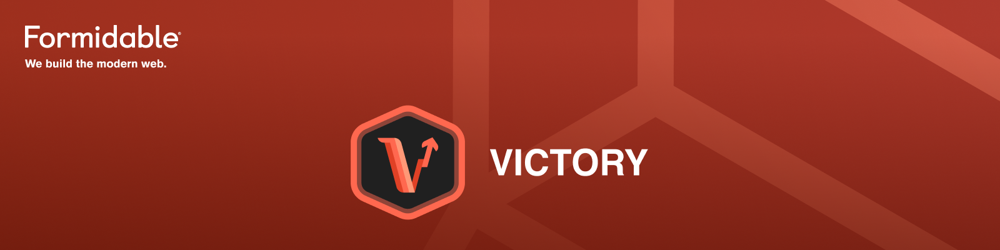

  

  <strong>
    high-performance charts powered by D3, Skia, and Reanimated for React Native.
  </strong>

   
   

  
  
  

  

## LICENSE

MIT

## Maintenance Status

**Active:** Formidable is actively working on this project, and we expect to continue for work for the foreseeable future. Bug reports, feature requests and pull requests are welcome.

[maintenance-image]: https://img.shields.io/badge/maintenance-active-green.svg
