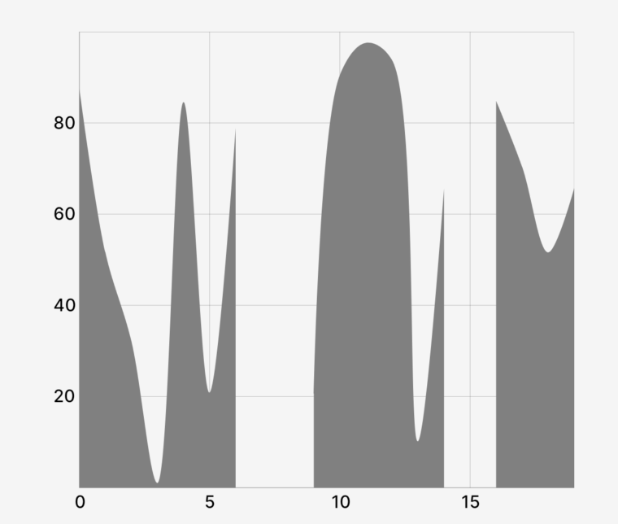
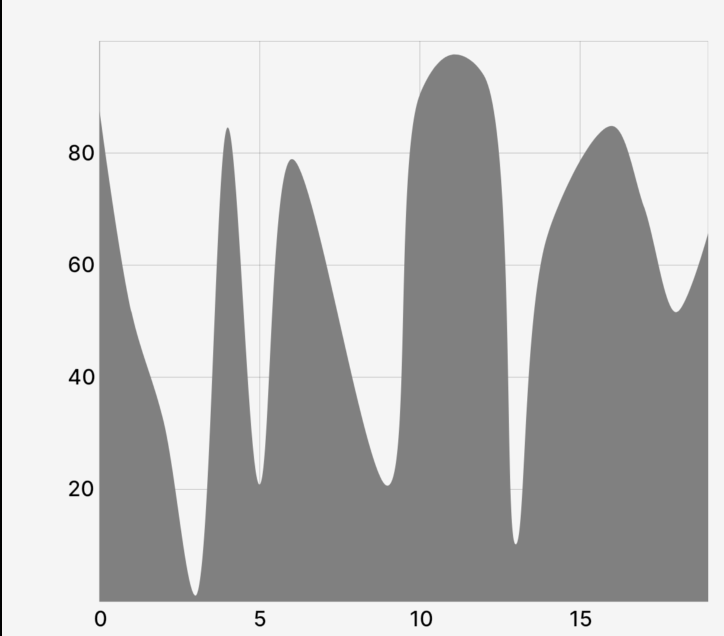

# `Area` (Component)

The `Area` component takes a `PointsArray` prop, a value for the "bottom" of the area, and some options for styling/animating, and returns a Skia `Path` element to draw the line chart.

## Example

```tsx
import { CartesianChart, Area } from "victory-native";
import DATA from "./my-data";

export function MyChart() {
  return (
    <CartesianChart data={DATA} xKey="x" yKeys={["y"]}>
      {({ points, chartBounds }) => (
        //👇 pass a PointsArray to the Line component, y0, as well as options.
        <Area
          points={points.y}
          y0={chartBounds.bottom}
          color="red"
          animate={{ type: "timing", duration: 300 }}
        />
      )}
    </CartesianChart>
  );
}
```

## Props

### `points`

A `PointsArray` array that comes from a field of the `points` object exposed the `children` render function of `CartesianChart`, as illustrated in the example above.

### `y0`

A `number` that indicates where the "bottom" of the area path should run. This number should be in _canvas coordinates_.

### `animate`

The `animate` prop takes [a `PathAnimationConfig` object](../../animated-paths.md#animconfig) and will animate the path when the points changes.

### `curveType`

[A `CurveType` value](./use-area-path.md#options) that indicates the type of curve should be drawn (e.g. `linear` or `natural`).

### `connectMissingData`

[The `connectMissingData: boolean` value](./use-line-path.md#options) that indicates whether missing data should be interpolated for the resulting `Path`. If set to `true`, the output will be a single, connected area chart path (even if there are missing data values). If set to `false`, if there is missing data values – the path will consist of multiple disconnected "parts".

<div class="flex flex-col md:flex-row gap-4">
<div class="flex-1">

`connectMissingData={false}`



</div>

<div class="flex-1">

`connectMissingData={true}`



</div>
</div>

### `children`

A `children` pass-thru that will be rendered inside of the Skia `Path` element, useful if you'd like to make e.g. a gradient path.

### Paint properties

The `Area` component will also pass the following [painting props](https://shopify.github.io/react-native-skia/docs/paint/overview) down to the underlying `Path` component:

- `color`
- `blendMode`
- `opacity`
- `antiAlias`
