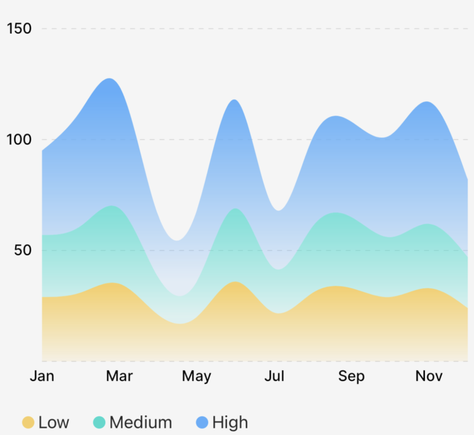

# `StackedArea` (Component)

The `StackedArea` component takes an **array of `Points[]`** as `points`, a `y0` point, a `colors` array, an `areaOptions` render prop to customize each layer, and some options for styling/animating, and returns a Skia `Path` element which draws the stacked area chart.

<div className="w-96 mx-auto rounded-md overflow-hidden">



</div>

:::tip

The [example app](https://github.com/FormidableLabs/victory-native-xl/tree/main/example) inside this repo has a lot of examples of how to use the `StackedArea` chart and its associated components and props!

:::

## Example

```tsx
import { CartesianChart, StackedArea } from "victory-native";
import { DashPathEffect, LinearGradient } from "@shopify/react-native-skia";

const generateData = () =>
  Array.from({ length: 12 }, (_, index) => {
    const low = Math.round(20 + 20 * Math.random());
    const med = Math.round(low - 5 * Math.random());
    const high = Math.round(low + 3 + 20 * Math.random());

    return {
      month: new Date(2020, index).toLocaleString("default", {
        month: "short",
      }),
      low,
      med,
      high,
    };
  });

export function MyChart() {
  const [data] = useState(DATA(4));
  return (
    <CartesianChart
      data={data}
      xKey="month"
      yKeys={["low", "med", "high"]}
      padding={8}
      domain={{ y: [0, 150] }}
      domainPadding={{ top: 0 }}
      xAxis={{
        font,
        labelOffset: 4,
        lineWidth: 0,
      }}
      yAxis={[
        {
          labelOffset: 8,
          font,
          linePathEffect: <DashPathEffect intervals={[4, 4]} />,
        },
      ]}
      onChartBoundsChange={({ left, right, top, bottom }) => {
        setW(right - left);
        setH(bottom - top);
      }}
    >
      {({ points, chartBounds }) => (
        <>
          <StackedArea
            points={[points.low, points.med, points.high]}
            y0={chartBounds.bottom}
            curveType="natural"
            animate={{ type: "spring" }}
            areaOptions={({ rowIndex, lowestY, highestY }) => {
              switch (rowIndex) {
                case 0:
                  return {
                    children: (
                      <LinearGradient
                        start={vec(0, highestY - 25)}
                        end={vec(0, lowestY)}
                        colors={["#f7ce64", "#f7ce6420"]}
                      />
                    ),
                  };
                case 1:
                  return {
                    children: (
                      <LinearGradient
                        start={vec(0, highestY - 100)}
                        end={vec(0, lowestY)}
                        colors={["#22dacd", "#22dacd20"]}
                      />
                    ),
                  };
                case 2:
                  return {
                    children: (
                      <LinearGradient
                        start={vec(0, highestY - 100)}
                        end={vec(0, lowestY)}
                        colors={["#56aefb", "#56aefb20"]}
                      />
                    ),
                  };
                default:
                  return {};
              }
            }}
          />
        </>
      )}
    </CartesianChart>
  );
}
```

## Props

### `points`

An array of `PointsArrays` that comes from the fields of the `points` object, as illustrated in the example above. You need to specify each key; you can't just do `points={[...points]}`.

### `y0`

A `number` that indicates where the "bottom" of the area path should run. This number should be in _canvas coordinates_.

### `animate`

The `animate` prop takes [a `PathAnimationConfig` object](../../animated-paths.md#animconfig) and will animate the path when the points change.

### `colors`

The `colors` prop takes an array of `Color` values to use for the layers. The order of the colors should match the order of the `points` prop.

### `curveType`

[A `CurveType` value](./use-area-path.md#options) that indicates the type of curve should be drawn (e.g. `linear` or `natural`).

### `areaOptions`

The `areaOptions` prop is a render function with a signature like this:

```tsx
type CustomizablePathProps = Partial<
  Pick<PathProps, "color" | "blendMode" | "opacity" | "antiAlias">
>;
areaOptions?: ({
    rowIndex,
    lowestY,
    highestY,
  }: {
    rowIndex: number; // the index of the layer
    lowestY: number; // the lowest Y value for this layer
    highestY: number; // the highest Y value for this layer
  }) => CustomizablePathProps & {
    children?: React.ReactNode;
  };
```

This prop allows you to customize each individual layer in the stacked area chart. You can use this to customize the `children` of each areas as well, allowing for things like `LinearGradients`, etc. See the example repo for more information.
