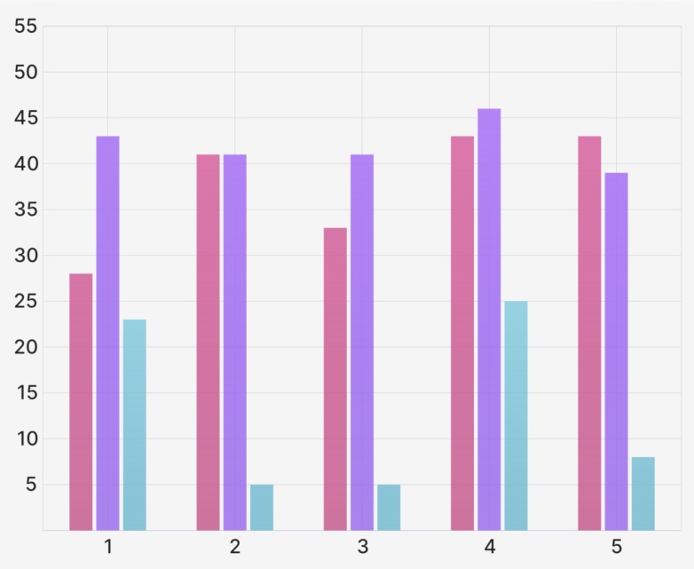

# `BarGroup` (Component)

The `BarGroup` component takes a `ChartBounds` object, some options for spacing, and some `BarGroup.Bar` children and returns an array of Skia `Path` elements to draw the grouped bar chart.

<div className="w-96 mx-auto rounded-md overflow-hidden">



</div>

## Example

```tsx
import { CartesianChart, BarGroup } from "victory-native";
import DATA from "./my-data";

export function MyChart() {
  return (
    <CartesianChart data={DATA} xKey="x" yKeys={["y", "z"]}>
      {({ points, chartBounds }) => (
        <BarGroup
          chartBounds={chartBounds}
          betweenGroupPadding={0.3}
          withinGroupPadding={0.1}
        >
          <BarGroup.Bar points={points.y} color="red" />
          <BarGroup.Bar points={points.z} color="blue" />
        </BarGroup>
      )}
    </CartesianChart>
  );
}
```

## Props

### `chartBounds`

A `ChartBounds` object needed to appropriately draw the bars. This generally comes from the `chartBounds` render argument of `CartesianChart`.

### `betweenGroupPadding`

An optional `number` between 0 and 1 that represents what fraction of the horizontal space between the first and last bar groups should be "white space". Defaults to `0.2`. Use `0` for no gap between groups, and values closer to `1` to make bars increasingly narrow.

### `withinGroupPadding`

An optional `number` between 0 and 1 that represents what fraction of the horizontal space between the first and last bars _within a group_ should be "white space". Defaults to `0.2`. Use `0` for no gap between bars within a group, and values closer to `1` to make bars increasingly narrow.

### `onBarSizeChange`

An optional callback of the form:

```ts
onBarSizeChange: (values: {
  barWidth: number;
  groupWidth: number;
  gapWidth: number;
}) => void;
```

That alerts the consumer when the size of the bars/groups changes, useful for if you're building a custom tooltip and need to know the size of the groups/bars.

### `children`

An array of `BarGroup.Bar` elements (see below) that represent the bars to add to the bar group.

## `BarGroup.Bar` Props

### `points`

A `PointsArray` array indicating the dataset to be used for this particular bar. Generally comes from the `points` value of the `CartesianChart` render function argument.

### `animate`

The `animate` prop takes [a `PathAnimationConfig` object](../../animated-paths.md#animconfig) and will animate the path when the points changes.

### `children`

A `children` pass-thru that will be rendered inside of the Skia `Path` element, useful if you'd like to make e.g. a gradient path.

### Paint properties

The `Line` component will also pass the following [painting props](https://shopify.github.io/react-native-skia/docs/paint/overview) down to the underlying `Path` component:

- `color`
- `blendMode`
- `opacity`
- `antiAlias`
