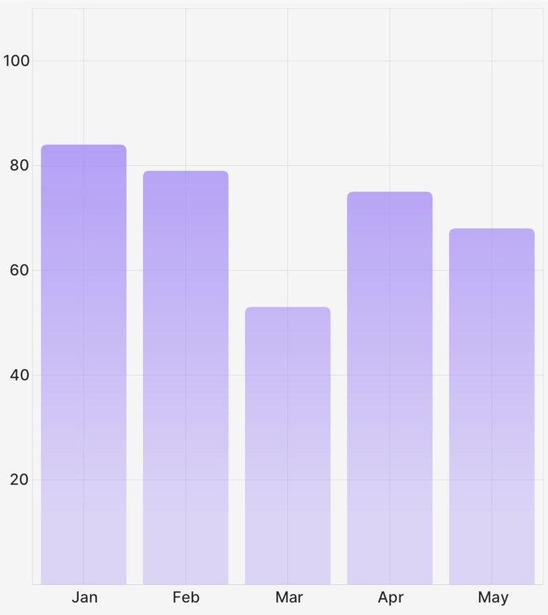

# `Bar` (Component)

The `Bar` component takes a `PointsArray` prop, a `ChartBounds` object, as well as some options for styling/animating, and returns a Skia `Path` element to draw the bar chart.

<div className="w-96 mx-auto rounded-md overflow-hidden">



</div>

## Example

```tsx
import { CartesianChart, Bar } from "victory-native";
import DATA from "./my-data";

export function MyChart() {
  return (
    <CartesianChart data={DATA} xKey="x" yKeys={["y"]}>
      {({ points, chartBounds }) => (
        //👇 pass a PointsArray to the Bar component, as well as options.
        <Bar
          points={points.y}
          chartBounds={chartBounds}
          color="red"
          roundedCorners={{ topLeft: 10, topRight: 10 }}
        />
      )}
    </CartesianChart>
  );
}
```

## Props

### `points`

A `PointsArray` array that comes from a field of the `points` object exposed the `children` render function of `CartesianChart`, as illustrated in the example above.

### `chartBounds`

A `ChartBounds` object needed to appropriately draw the bars. This generally comes from the `chartBounds` render argument of `CartesianChart`.

### `innerPadding`

An optional `number` between 0 and 1 that represents what fraction of the horizontal space between the first and last bars should be "white space". Defaults to `0.2`. Use `0` for no gap between bars, and values closer to `1` to make bars increasingly narrow.

### `animate`

The `animate` prop takes [a `PathAnimationConfig` object](../../animated-paths.md#animconfig) and will animate the path when the points change.

### `roundedCorners`

The `roundedCorners` prop allows you to customize the roundedness of each corner of the Bar component. It's an object type that defines the radii for the top-left, top-right, bottom-right, and bottom-left corners.

- `topLeft?: number`: Defines the radius of the top-left corner of the Bar. If not provided, the default is 0 (no rounding).
- `topRight?: number`: Defines the radius of the top-right corner of the Bar. If not provided, the default is 0 (no rounding).
- `bottomRight?: number`: Defines the radius of the bottom-right corner of the Bar. If not provided, the default is 0 (no rounding).
- `bottomLeft?: number`: Defines the radius of the bottom-left corner of the Bar. If not provided, the default is 0 (no rounding).

### `barWidth`

The `barWidth` prop takes a number and sets the width of the bar to that number. If not provided, the default is determined by the `chartBounds` and number of data points. Takes precedence over the `barCount` prop. Use this for the most fine grained control of bar width

### `barCount`

The `barCount` prop takes a number and sets the width of the bar as if there X data points. If not provided, the default is determined by the `chartBounds` and number of data points. Useful for getting a fixed bar width regardless of the number of data points. Use this for a more general control of bar width.

### `labels`

The `labels` prop allows you to enable and customize the data label of the Bar component. The data label text is the Y-axis value associated with the Bar component.

- `position: "top" | "bottom" | "left" | "right"`: Defines where the Bar component data label should be rendered in relationship to the rendered Bar component.
- `font: SkFont | null`: Defines the font to use with the Skia `Text` component.
- `color?: Color`: Defines the color the data label should be.
- `labelRotate?: number`: Defines the rotation angle of the data label in degrees.
- `format?: (value: number) => string`: Defines a function that formats the data label text. It receives the Y-axis value as an argument and should return a string. If not provided, the default is to convert the Y-axis value to a string.

### `children`

A `children` pass-thru that will be rendered inside of the Skia `Path` element, useful if you'd like to make e.g. a gradient path.

### Paint properties

The `Line` component will also pass the following [painting props](https://shopify.github.io/react-native-skia/docs/paint/overview) down to the underlying `Path` component:

- `color`
- `blendMode`
- `opacity`
- `antiAlias`
