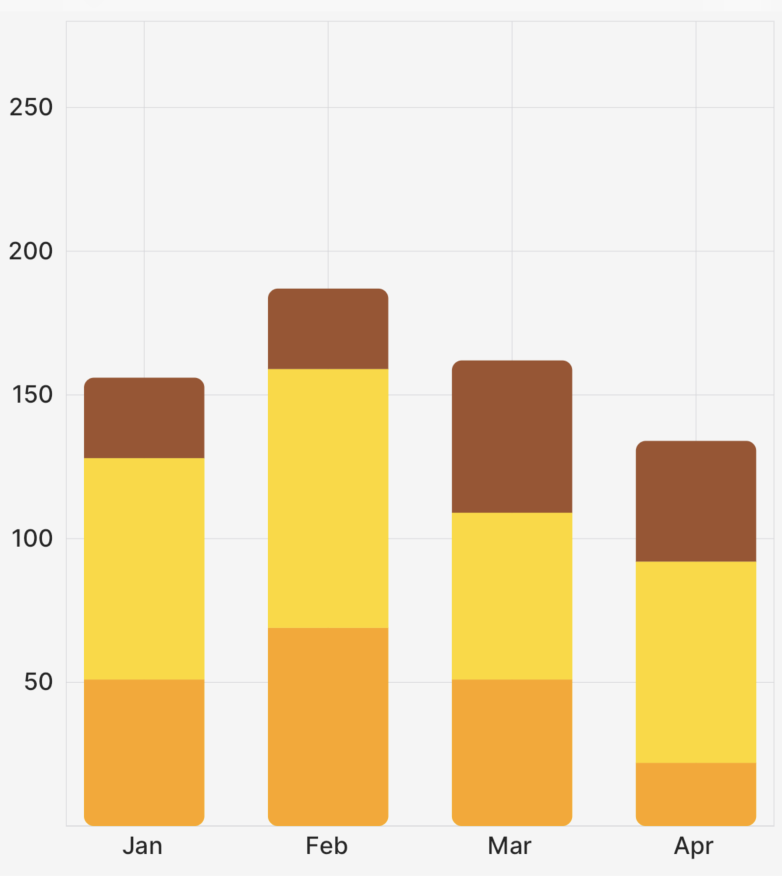

# `StackedBar` (Component)

The `StackedBar` component takes an **array of `Points[]`** as `points`, a `ChartBounds` object, a `colors` array, a `barOptions` render prop to customize each bar/row/column, and some options for styling/animating, and returns a Skia `Path` element which draws the stacked bar chart.

<div className="w-96 mx-auto rounded-md overflow-hidden">



</div>

:::tip

The [example app](https://github.com/FormidableLabs/victory-native-xl/tree/main/example) inside this repo has a lot of examples of how to use the `StackedBar` chart and its associated components and props!

:::

## Example

```tsx
import { CartesianChart, Bar } from "victory-native";

const DATA = (length: number = 10) =>
  Array.from({ length }, (_, index) => ({
    month: index + 1,
    listenCount: Math.floor(Math.random() * (100 - 50 + 1)) + 50,
    favouriteCount: Math.floor(Math.random() * (100 - 50 + 1)) + 20,
    sales: Math.floor(Math.random() * (100 - 50 + 1)) + 25,
  }));

export function MyChart() {
  const [data] = useState(DATA(4));
  return (
    <CartesianChart
      data={data} // 👈 specify your data
      xKey="month" // 👈 specify your x key
      yKeys={["listenCount", "favouriteCount", "sales"]} // 👈 specify *each* of your *yKeys* you wish to stack, the order matters here
      domainPadding={{ left: 50, right: 50, top: 30 }}
      domain={{ y: [0, 250] }} // 👈 you'll need to hardcode your y-domain (for now)
      axisOptions={{
        font,
        formatXLabel: (value) => {
          const date = new Date(2023, value - 1);
          return date.toLocaleString("default", { month: "short" });
        },
        lineColor: isDark ? "#71717a" : "#d4d4d8",
        labelColor: isDark ? appColors.text.dark : appColors.text.light,
      }}
      padding={5}
    >
      {({ points, chartBounds }) => {
        return (
          <StackedBar
            animate={{ type: "spring" }}
            innerPadding={innerPadding}
            chartBounds={chartBounds}
            points={[points.listenCount, points.favouriteCount, points.sales]} // 👈 the order here must match the order above
            colors={["orange", "gold", "sienna"]} // 👈 specify your colors
            barOptions={({ isBottom, isTop }) => {
              // 👇 customize each individual bar as desired
              return {
                roundedCorners: isTop
                  ? {
                      topLeft: roundedCorner,
                      topRight: roundedCorner,
                    }
                  : isBottom
                    ? {
                        bottomRight: roundedCorner,
                        bottomLeft: roundedCorner,
                      }
                    : undefined,
              };
            }}
          />
        );
      }}
    </CartesianChart>
  );
}
```

## Props

### `points`

An array of `PointsArrays` that comes from the fields of the `points` object, as illustrated in the example above. You need to specify each key; you can't just do `points={[...points]}`.

### `chartBounds`

A `ChartBounds` object needed to appropriately draw the bars. This generally comes from the `chartBounds` render argument of `CartesianChart`.

### `innerPadding`

An optional `number` between 0 and 1 that represents what fraction of the horizontal space between the first and last bars should be "white space". Defaults to `0.2`. Use `0` for no gap between bars, and values closer to `1` to make bars increasingly narrow.

### `animate`

The `animate` prop takes [a `PathAnimationConfig` object](../../animated-paths.md#animconfig) and will animate the path when the points change.

### `colors`

The `colors` prop takes an array of `Color` values to use for the bars. The order of the colors should match the order of the `points` prop.

### `barWidth`

The `barWidth` prop takes a number and sets the width of the bar to that number. If not provided, the default is determined by the `chartBounds` and number of data points. Takes precedence over the `barCount` prop. Use this for the most fine grained control of bar width

### `barCount`

The `barCount` prop takes a number and sets the width of the bar as if there X data points. If not provided, the default is determined by the `chartBounds` and number of data points. Useful for getting a fixed bar width regardless of the number of data points. Use this for a more general control of bar width.

### `barOptions`

The `barOptions` prop is a render function with a signature like this:

```tsx
type CustomizablePathProps = Partial<
  Pick<PathProps, "color" | "blendMode" | "opacity" | "antiAlias">
>;
barOptions?: ({
    columnIndex,
    rowIndex,
    isBottom,
    isTop,
  }: {
    isBottom: boolean;
    isTop: boolean;
    columnIndex: number;
    rowIndex: number;
  }) => CustomizablePathProps & { roundedCorners?: RoundedCorners };
```

This prop allows you to customize each individual bar in the stacked bar chart. You can use this to customize the `children` of each bar as well, allowing for things like `LinearGradients`, etc. See the example repo for more information.
