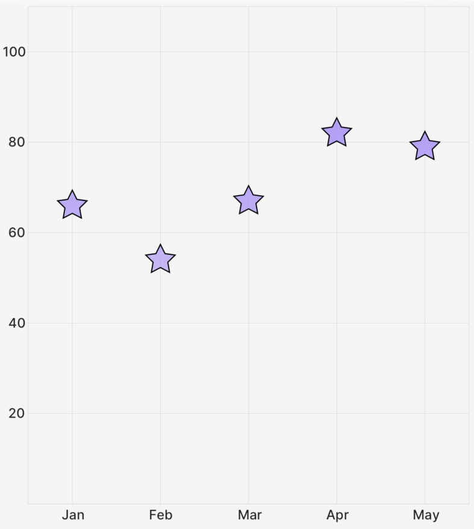

# `Scatter` (Component)

The `Scatter` component takes a `PointsArray` prop, as well as some options for styling/animating, and returns a Skia `Path` element to draw the scatter plot.

<div className="w-96 mx-auto rounded-md overflow-hidden">



</div>

## Example

```tsx
import { CartesianChart, Scatter } from "victory-native";
import DATA from "./my-data";

export function MyChart() {
  return (
    <CartesianChart data={DATA} xKey="x" yKeys={["y"]}>
      {({ points }) => (
        //👇 pass a PointsArray to the Scatter component
        <Scatter
          points={points.y}
          shape="star"
          radius={10}
          style="fill"
          color="red"
        />
      )}
    </CartesianChart>
  );
}
```

## Props

### `points`

A `PointsArray` array that comes from a field of the `points` object exposed the `children` render function of `CartesianChart`, as illustrated in the example above.

### `radius`

An optional `number` value or `(pt: PointsArray[number]) => number` function representing the radius of the individual scatter elements (e.g. radius of the circle, half the width of the square).

Pass a `number` to use the same radius for all of the scatter points. If you'd to use a dynamic radius per-point, you can pass a function that allows you to determine radius on a point-by-point basis.

The following snippet shows how to make the points' radius be based on the value of the point. The smallest-value point will have a radius of 5, and the largest-value point will have a radius of 20.

```tsx
import { interpolate } from "react-native-reanimated";
// ...

<CartesianChart data={data} xKey="x" yKeys={["y"]}>
  {({ points }) => {
    // 👇 compute min/max values
    const min = Math.min(...points.y.map((p) => p.yValue));
    const max = Math.max(...points.y.map((p) => p.yValue));

    return (
      <>
        <Scatter
          points={points.y}
          // 👇 and interpolate from 5 to 20 for radius size.
          radius={(pt) => interpolate(pt.yValue, [min, max], [5, 20])}
        />
      </>
    );
  }}
</CartesianChart>;
```

### `shape`

One of the following `ScatterShape` values that determines the shape of each point to be drawn.

```ts
type ScatterShape = "circle" | "square" | "star";
```

### `animate`

The `animate` prop takes [a `PathAnimationConfig` object](../../animated-paths.md#animconfig) and will animate the path when the points change.

### `children`

A `children` pass-thru that will be rendered inside of the Skia `Path` element, useful if you'd like to make e.g. a gradient path.

### Paint properties

The `Line` component will also pass the following [painting props](https://shopify.github.io/react-native-skia/docs/paint/overview) down to the underlying `Path` component:

- `style`
- `color`
- `blendMode`
- `opacity`
- `antiAlias`
- `start`
- `end`
- `strokeWidth`
- `stroke`
- `strokeJoin`
- `strokeCap`
