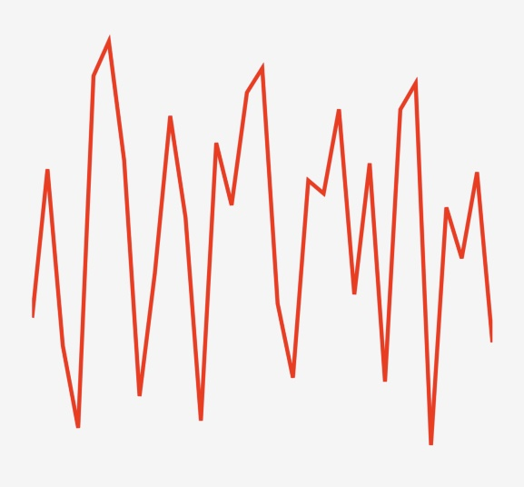
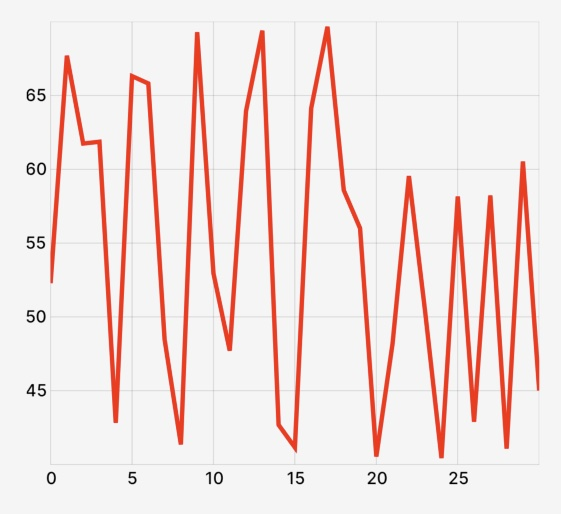

import ReactPlayer from "react-player/lazy";
import tooltipMp4 from "./assets/getting-started-tooltip.mp4";

# Getting Started

## Installation

Start by installing the peer dependencies of `victory-native` – [React Native Reanimated](https://docs.swmansion.com/react-native-reanimated/), [Gesture Handler](https://docs.swmansion.com/react-native-gesture-handler/), and [Skia](https://shopify.github.io/react-native-skia/):

```shell
yarn add react-native-reanimated react-native-gesture-handler @shopify/react-native-skia
```

For Reanimated, you'll need to add `"react-native-reanimated/plugin"` to your `plugins` list in your `babel.config.js` config file.

Then install `victory-native`:

```shell
yarn add victory-native
```

Now you should be ready to go.

> [!NOTE]  
> `victory-native-xl` diverged from the original `victory-native` after version 36+. If you encounter issues, please force the installed version with `yarn add victory-native@40.0.3`.

## Your first chart

Let's create a basic line chart on a Cartesian grid. Let's mock out a little bit of mock data for "high temperature" for each day in a month:

```ts
const DATA = Array.from({ length: 31 }, (_, i) => ({
  day: i,
  highTmp: 40 + 30 * Math.random(),
}));
```

### Instantiate a chart

Now, we'll use the [`CartesianChart` component](./cartesian/cartesian-chart.md) and pass in our data, specifying which property we'll be using for our `x` (independent variable) and `y` (dependent variable) keys.

```tsx
import { View } from "react-native";
import { CartesianChart } from "victory-native";

// ...

function MyChart() {
  return (
    <View style={{ height: 300 }}>
      // 👇 start our chart
      <CartesianChart data={DATA} xKey="day" yKeys={["highTmp"]} />
    </View>
  );
}
```

At this point, we're you'll just see a blank view, since we aren't rendering anything useful to our charting canvas.

### Add a line to the chart

The `CartesianChart` uses a render function for its `children` prop. To render content inside of the Cartesian chart, you return Skia elements from the `children` render function. We'll use [the `Line` component](./cartesian/line/line.md) from `victory-native` to render a line path using our temperature data.

```tsx
import { View } from "react-native";
import { CartesianChart, Line } from "victory-native";

function MyChart() {
  return (
    <View style={{ height: 300 }}>
      <CartesianChart data={DATA} xKey="day" yKeys={["highTmp"]}>
        {/* 👇 render function exposes various data, such as points. */}
        {({ points }) => (
          // 👇 and we'll use the Line component to render a line path.
          <Line points={points.highTmp} color="red" strokeWidth={3} />
        )}
      </CartesianChart>
    </View>
  );
}
```

Now we've got a line path to represent our daily high temperature data!

<div style={{ maxWidth: 400, margin: "0px auto" }}>



</div>

### Add some axes

You might want some axes to make your line graph a bit easier to read and interpret. The `CartesianChart` offers [out-of-the-box support for axes and grids](./cartesian/cartesian-chart.md#axisoptions) to make it easy to get up and running with some axes. Let's add some now.

```tsx
import { View } from "react-native";
import { CartesianChart, Line } from "victory-native";
// 👇 import a font file you'd like to use for tick labels
import inter from "../assets/inter-medium.ttf";

function MyChart() {
  const font = useFont(inter, 12);

  return (
    <View style={{ height: 300 }}>
      <CartesianChart
        data={DATA}
        xKey="day"
        yKeys={["highTmp"]}
        // 👇 pass the font, opting in to axes.
        axisOptions={{ font }}
      >
        {({ points }) => (
          <Line points={points.highTmp} color="red" strokeWidth={3} />
        )}
      </CartesianChart>
    </View>
  );
}
```

And now we've got some axes and grid lines!

<div style={{ maxWidth: 400, margin: "0px auto" }}>



</div>

### Adding a tooltip

You might also want to give your users a way to interact with the line chart you've created. Handling user gestures can be complex, especially in canvas-like drawing context. Victory Native helps streamline this for you. To build a basic tooltip, we'll do three things.

- Create a `ChartPressState` instance using [the `useChartPressState` hook](./cartesian/chart-gestures.mdx#usechartpressstate) from `victory-native`.
- Pass our state variable into our `<CartesianChart />` element.
- Use the Reanimated shared values from the `ChartPressState` instance in a custom `ToolTip` component that we'll create to create our tooltip element.

We'll start by creating our `ChartPressState` instance and pass it to our chart element.

```tsx
// ...
import { /*...*/ useChartPressState } from "victory-native";

function MyChart() {
  // ...
  // 👇 create our chart press state
  const { state, isActive } = useChartPressState({ x: 0, y: { highTmp: 0 } });

  return (
    // ...
    <CartesianChart
      // ...
      chartPressState={state} // 👈 and pass it to our chart.
    >
      {/* ... */}
    </CartesianChart>
    // ...
  );
}

// ...
```

Then we'll create a `ToolTip` component that uses some Reanimaed `SharedValue`s from our `state` variable.

```tsx
import type { SharedValue } from "react-native-reanimated";
// ...

function ToolTip({ x, y }: { x: SharedValue<number>; y: SharedValue<number> }) {
  return <Circle cx={x} cy={y} r={8} color="black" />;
}
```

And we'll conditionally show an instance of this component when the chart press is active:

```tsx
// ...
import { /*...*/ useChartPressState } from "victory-native";

function MyChart() {
  // ...
  const { state, isActive } = useChartPressState({ x: 0, y: { highTmp: 0 } });

  return (
    // ...
    <CartesianChart
      // ...
      chartPressState={state}
    >
      {
        (/*...*/) => (
          <>
            {/* 👇 Conditionally show our tooltip and pass values. */}
            {isActive ? (
              <ToolTip x={state.x.position} y={state.y.highTmp.position} />
            ) : null}
          </>
        )
      }
    </CartesianChart>
    // ...
  );
}

// ...
```

With this in place, we have a rather simple tooltip UI:

<div className="flex justify-center mb-10">
  <div className="rounded overflow-hidden">
    <ReactPlayer
      width={350}
      height={(644 / 710) * 350}
      playing={true}
      loop={true}
      controls={true}
      url={tooltipMp4}
    />
  </div>
</div>

Putting this all together, we have something like the following:

```tsx
import * as React from "react";
import { View } from "react-native";
import { CartesianChart, Line, useChartPressState } from "victory-native";
import { Circle, useFont } from "@shopify/react-native-skia";
import type { SharedValue } from "react-native-reanimated";
import inter from "../../assets/inter-medium.ttf"; // Wherever your font actually lives

function MyChart() {
  const font = useFont(inter, 12);
  const { state, isActive } = useChartPressState({ x: 0, y: { highTmp: 0 } });

  return (
    <View style={{ height: 300 }}>
      <CartesianChart
        data={DATA}
        xKey="day"
        yKeys={["highTmp"]}
        axisOptions={{
          font,
        }}
        chartPressState={state}
      >
        {({ points }) => (
          <>
            <Line points={points.highTmp} color="red" strokeWidth={3} />
            {isActive && (
              <ToolTip x={state.x.position} y={state.y.highTmp.position} />
            )}
          </>
        )}
      </CartesianChart>
    </View>
  );
}

function ToolTip({ x, y }: { x: SharedValue<number>; y: SharedValue<number> }) {
  return <Circle cx={x} cy={y} r={8} color="black" />;
}

const DATA = Array.from({ length: 31 }, (_, i) => ({
  day: i,
  highTmp: 40 + 30 * Math.random(),
}));
```
